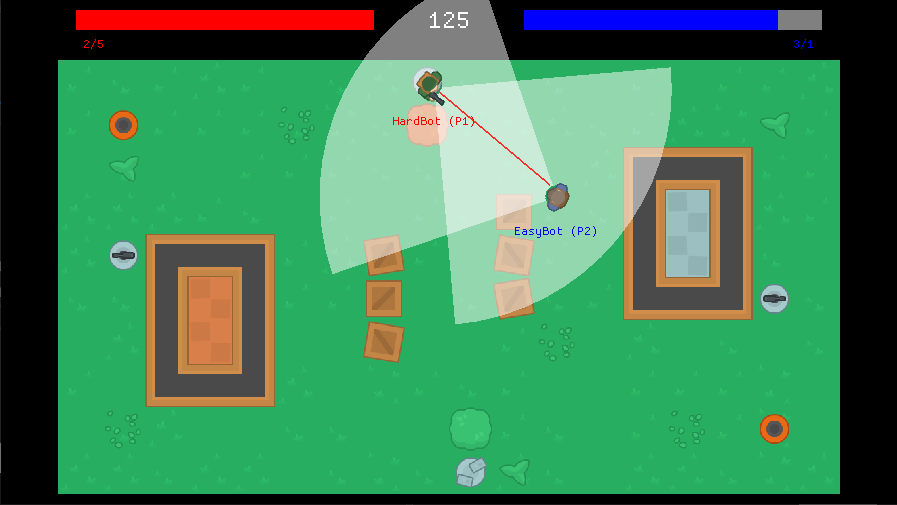

# Bot Battles
[Bot Battles](https://github.com/Sandruski/bot-battles) is a 2D online multiplayer shooter video game about programming your own bot and battling against others. Two clients compete in an authoritative server.

# Requirements
- [Python 3.8.3](https://www.python.org/downloads/release/python-383/)

To use the example bots:
- [PyGLM](https://pypi.org/project/PyGLM/)

# Installation
1. Go to [Releases](https://github.com/Sandruski/bot-battles/releases) and download the latest release.
2. Unzip the game and open its folder.
3. Go to bin>bin86 for the 32-bit version or bin>bin64 for the 64-bit version.
4. Run one instance of server.exe and two instances of client.exe.

# How to play
## Code a bot
1. Go to data>scripts>bots.
2. Copy exampleBot.py or create a new .py file in the same folder.
3. Open it in Visual Studio.
4. Go to data>scripts>stubs.
5. Open botbattles.pyi in Visual Studio too.
6. Go to docs.
7. Open botAPI.md.
8. Code your bot.
9. Once you're done, save it.

## Create a map
1. Download [Tiled](https://www.mapeditor.org/) and install it.
2. Go to data>source.
3. Open backyard.tmx or house.tmx or create a new map in Tiled.
4. Edit your map.
5. Once you're done, export it as a .json in data>maps.

## Battle
1. On the client, write the IP and the port of the server, your name, and select the bot that you want to play with. The bot can be one of the example bots (easyBot or hardBot) or your own bot.
2. On the server, write its port, and select the map that you want to play in and the duration of the game. The map can be one of the example maps (backyard or house) or your own map.
3. Wait until the connection between the client and the server is established.
4. Watch the deathmatch.
5. Once it is over, go to the directory of the executable of the game.
6. Open the .log file to check the output of your bot.

Have fun!

# Controls
- Esc: toggle Settings menu
- F1: toggle Debug Options menu

Only during gameplay:
- O: toggle Log output
- Left Shift + W: end the match

# Changelog
## Gold
- Listed all the variables and methods of the bot API in a file located in the game folder.
- Wrote two scripts derived from the example bot class, one for an easy bot and one for a hard bot.

## Beta
- Integrated Optick for profiling.
- Rendered using instancing to improve the performance.
- Added debug draw for lines, circles, and quads.
- Renamed the system Spawner System to Bot Spawner System.
- Added the systems Sight System, Bot System, Map System, Weapon Spawner System, and Health Spawner System.
- Renamed the component Spawner Component to Bot Spawner Component.
- Added the components Sight Component, Weapon Spawner Component, Health Spawner Component, and Map Component.
- Included triggers in the Collider Component.
- Changed the icon of the window.
- Performed input validation of the inputs of players.
- Added spawners of weapons and ammunition boxes and first aid boxes.
- Destroyed the collectible objects once picked up.
- Set up maximum values of physical properties.
- Set up minimum values of timings of actions.
- Restricted the actions to only be able to perform one at a time.
- Upgraded the example bot to feature a movement system and a decision-making system.
- Included a stub file to provide type information to the bots.
- Handled exceptions to prevent the game from crashing.
- Sent events from server updates to the script.
- Replicated only the objects seen by the bots.

## Alpha
- Replaced the raycaster utility with Box2D to guarantee more accurate and realistic physics.
- Handled floating-point errors.
- Added the system Physics System.
- Added the components Physics Component, Rigidbody Component, Bot Component, and Wall Component.
- Added client’s Output panel.
- Implemented the Scripting System together with its Scripting Component to manage the Python communication.
- Implemented the Bot Battles Module for the binding code.
- Added a panel in the game and a file in its folder to print the logs of the bots.
- Chose Python as the scripting language.
- Passed the Input Component by reference to the script every update.
- Passed the components of the bot by reference to the script on initialization.
- Sent events from client updates to the script.
- Wrote a main script, a script for the base class of a bot, and a script for an example bot derived from the base class.

## Vertical Slice
- Rendered using OpenGL directly rather than SDL to integrate Dear ImGui.
- Added draw layers.
- Replaced the math utilities with GLM to fit with OpenGL.
- Implemented a simple raycaster utility to perform scene queries.
- Added the resources Mesh Resource and Shader Resource, with their respective importers.
- Added the Map Importer.
- Removed the resources Font Resource and Text Resource.
- Renamed the resource Sprite Resource to Texture Resource.
- Added the systems GUI System, Weapon System, and Health System.
- Added the components GUI Component, Weapon Component, Health Component, Player Component, Local Player Component, Remote Player Component, Spawner Component, Main Menu Component, Gameplay Component, and Scoreboard Component.
- Added the Debug Options panel and the Settings panel.
- Added the scene Scoreboard State.
- Defined server’s Play, Results, and Bye messages and client’s Bye message to maintain and close the communication.
- Also used TCP sockets to transfer packets.
- Defined server’s Unwelcome message to limit the amount of players per session.
- Established a win-lose condition.
- Spawned all element objects of the map when the session is created to allow players to interact with them.
- Added a weapon to the character object to allow it to shoot.
- Erased the algorithm to simulate real world conditions to test netcode with Clumsy instead.
- Implemented a technique for lag compensation to prevent unexpected results from occurring when shooting with lag.

## Proof of Concept
- Implemented simple utilities, such as math utilities.
- Implemented a Resource Manager, an ECS with an Entity Manager, a Component Manager, and a System Manager, and a FSM.
- Added the resources Sprite Resource, Font Resource, and Text Resource, with their respective importers.
- Added the systems Event System, Window System, Renderer System, Label System, Collision System, Input System, Movement System, and Spawner System.
- Added the components Transform Component, Sprite Component, Label Component, Collider Component, Event Component, Window Component, Renderer Component, and Input Component.
- Added the scenes Main Menu State and Gameplay State.
- Implemented the Client System together with its Client Component and Server System together with its Server Component to manage the network communication.
- Defined client’s Hello and Input messages and server’s Welcome and State messages to establish and maintain the communication.
- Implemented input and output memory streams to serialize the game data.
- Implemented a linking context to serialize the game data.
- Implement a replication manager to replicate the game data.
- Used UDP sockets to transfer packets.
- Wrote an algorithm to simulate real world conditions to test the netcode.
- Implemented a technique for client-side prediction and server reconciliation to hide the abrupt movement of the local character present with lag.
- Implemented a technique for entity interpolation to hide the abrupt movement of remote characters present with lag.
- Spawned a character object for the player when a player joined the session to allow the player to control it.

# About
The application is written in C++ and follows the ISO C++ 17 Standard. The scripts are written in Python.

## Tools
- Microsoft Visual Studio
- Tiled Map Editor
- Aseprite
- Clumsy
- Optick

## Libraries
- SDL
- RapidJSON
- gl3w
- OpenGL Mathematics (GLM)
- STB Image
- Dear ImGui
- Box2D
- Winsock
- pybind11

## Assets
- [Kenney's Topdown Shooter pack](https://www.kenney.nl/assets/topdown-shooter)
- [Kenney's Topdown Tanks Redux pack](https://www.kenney.nl/assets/topdown-tanks-redux)
- [Kenney's Kenney Fonts pack](https://www.kenney.nl/assets/kenney-fonts)

# License
The project is under the MIT License.
